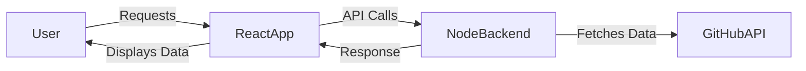

# Repofinder - React

## Table of Contents

1. [Introduction](#introduction)

   - [What is Repofinder?](#what-is-repofinder)
   - [Features](#features)

2. [Application Architecture](#application-architecture)

   - [Overview](#overview)
   - [Component Breakdown](#component-breakdown)
   - [State Management](#state-management)
   - [API Communication](#api-communication)

3. [Application Flow](#application-flow)

   - [Entry Point (`main.tsx`)](#entry-point-maintsx)
   - [App Initialization](#app-initialization)
   - [Routing & Navigation](#routing--navigation)
   - [Authentication Flow](#authentication-flow)
   - [Fetching and Displaying GitHub Repos](#fetching-and-displaying-github-repos)
   - [Favoriting Repositories](#favoriting-repositories)
   - [Error Handling & Edge Cases](#error-handling--edge-cases)

4. [Tech Stack](#tech-stack)

   - [Frontend Technologies](#frontend-technologies)
   - [Libraries & Dependencies](#libraries--dependencies)
   - [API & Backend Communication](#api--backend-communication)

5. [Project Setup & Installation](#project-setup--installation)

   - [Prerequisites](#prerequisites)
   - [Installation Steps](#installation-steps)
   - [Environment Variables](#environment-variables)

6. [Running the Application](#running-the-application)

   - [Development Mode](#development-mode)
   - [Production Build](#production-build)

7. [API Interaction](#api-interaction)

   - [Health Check API](#health-check-api)
   - [Authentication APIs](#authentication-apis)
   - [GitHub API Calls](#github-api-calls)
   - [Favorites API](#favorites-api)

8. [Folder Structure](#folder-structure)

9. [Deployment](#deployment)
   - [Deployment Steps](#deployment-steps)
   - [Azure Hosting](#azure-hosting)

## Introduction

### What is Repofinder?

Repofinder is a React application that helps users discover GitHub repositories efficiently. It interacts with the GitHub API via a Node.js Express backend, allowing users to search for repositories based on customizable parameters such as **topics, programming language, star count, result limit, sorting criteria,** and more. Users can configure these filters in the **Settings** section to refine their search and find repositories that align with their interests.

### Features

- **Search Repositories by Topic & Language** – Easily filter repositories based on relevant technologies and domains.
- **Find Active & Relevant Projects** – Avoid outdated or inactive repositories by prioritizing projects with recent activity.
- **Sort by Stars & Popularity** – Discover trending repositories based on their star count and engagement.
- **Reduce Overwhelm** – Many top-ranked repositories can be complex or inactive. Repofinder helps users find projects that are easier to contribute to based on recent activity and stack relevance.

## Application Architecture

### Overview

Repofinder follows a **client-server architecture**, where the frontend (React) communicates with the backend (Node.js + Express) to fetch repositories via the GitHub API. The application ensures seamless user authentication, state management, and API communication to provide an interactive user experience.



> The diagram above represents the data flow: Users interact with the React frontend, which fetches data from the backend, and the backend queries the GitHub API before returning the results to the client.

### Component Breakdown

```
src/components
├── Card.tsx
├── Combobox.tsx
├── Darklight.tsx
├── Error.tsx
├── Loader.tsx
├── MainContent.tsx
├── Nav.tsx
└── UserDropdown.tsx
```

The application consists of various reusable and structural components, categorized as follows:

#### **Core UI Components**

- **Card.tsx** – Displays repository details such as name, stars, and description.
- **Combobox.tsx** – A searchable dropdown component for selecting options like topics or languages.
- **Darklight.tsx** – Toggles between dark and light themes.
- **Error.tsx** – Displays error messages when API calls fail or when the backend is unreachable.
- **Loader.tsx** – A loading spinner shown during API calls or page transitions.

#### **Structural Components**

- **MainContent.tsx** – The primary layout container that renders content dynamically.
- **Nav.tsx** – The navigation bar containing links and user profile actions.
- **UserDropdown.tsx** – A headless component for user-related actions like logout and profile settings.

### State Management

Repofinder uses a combination of **Zustand** and **Context API** for efficient state management:

#### **Global State Management with Zustand**

Zustand is used for managing application-wide state while ensuring minimal re-renders. The following stores handle different aspects of the app:

```
src/store
├── appStore.ts
├── authStore.ts
├── index.ts
└── settingStore.ts
```

- **`appStore.ts`** – Manages global app settings like theme selection (dark/light mode).
- **`authStore.ts`** – Stores authentication details, including user session and JWT tokens.
- **`settingStore.ts`** – Maintains user-defined search filters (topics, language, stars, etc.).

#### **Context API for UI State**

Context API is used for handling UI-related transient states that don’t require persistence, such as:

- **Loader State** – Controls when to show/hide the loader during API requests and page transitions.

By combining **Zustand** for persistent, app-wide state and **Context API** for temporary UI state, Repofinder ensures a smooth and optimized user experience.
